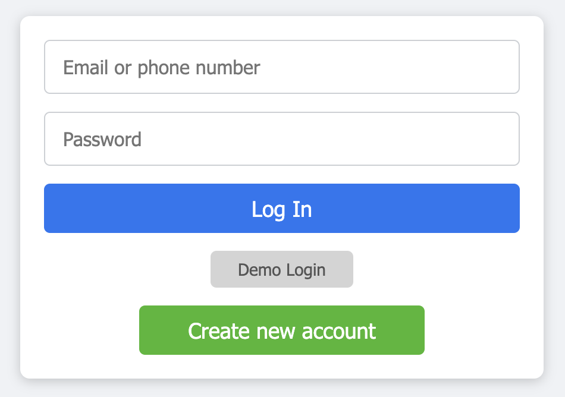
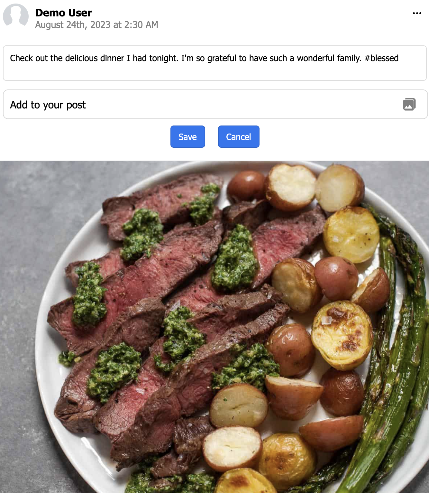
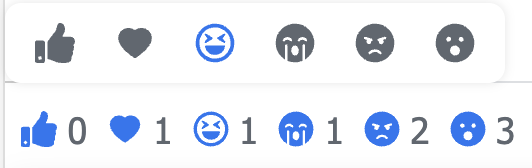

# Fakebook: A Social Media Experience

Welcome to **Fakebook**, a comprehensive social networking platform that offers a range of features. Whether you're looking to make new friends, share life updates, or react to posts, Fakebook has you covered.

---

## Table of Contents
1. [Profile Creation](#profile-creation)
2. [Add/Delete Friends](#adddelete-friends)
3. [Write/Update/Delete Posts](#writeupdatedelete-posts)
4. [Write/Update/Delete Comments](#writeupdatedelete-comments)
5. [Reactions to Posts or Comments](#reactions-to-posts-or-comments)
6. [View Other Users' Profiles](#view-other-users-profiles)
7. [User Search](#user-search)
8. [Challenges Faced](#challenges-faced)

---

## Profile Creation

On Fakebook, setting up a personalized profile is a breeze! During the sign-up process, fill in essential details like your name, email, and add a profile picture. Post-signup, go the extra mile and jazz up your profile with a cover photo, bio, and more.


<br>

<br>


---

## Add/Delete Friends

Friendship is just a click away on Fakebook! Send friend requests and, upon acceptance, share posts and updates with your new social circle. Don't get along anymore? Unfriending is just as easy.


---

## Write/Update/Delete Posts

Share what matters to you, the way you like! Fakebook allows text posts with multiple photos. You're the master of your posts; edit or delete them as you please.


<br>


---

## Write/Update/Delete Comments

Let the conversations begin! Comment on posts by you or your friends. Edit or delete them whenever you want. Oh, and don't forget you can add images to your comments too!


---

## Reactions to Posts or Comments

When words fail, emojis speak. Express how you feel about posts or comments using a variety of emojis. From "Like" to "Love" to "Angry," we've got them all!



---

## View Other Users' Profiles

Know more, grow more! Visit profiles to check out posts, photos, and the friend list, all depending on user privacy settings.


---

## User Search

Your next friend is a search away! Type names into the search bar and get basic profile details. Send friend requests directly from the search results.


---

## Challenges Faced

### Incorporating Uni-directional Friendships

I faced the challenge of incorporating friendships in a way that they count for both users involved. This was solved by filtering through friendships using a selector function that returns friends of a given user. This works regardless of whether the given user corresponds to the "friend_id" or the "user_id" column of the friendships table. Differentiating between "accepted", "pending", and "deleted" friendships was critical to returning the correct content from the backend to mimic the behavior of Facebook.

<pre> 
```javascript
export const getFriendsByUserId = (userId) => (state) => {
    if (!userId) return [];

    const friendships = getFriendships(state).filter(friendship => 
        friendship.status === 'accepted' && (friendship.userId === userId || friendship.friendId === userId));
    const friends = friendships.map(friendship => {
        const user1 = state.users[friendship.userId] || state.session.user;
        user1.friendshipId = friendship.id;
        const user2 = state.users[friendship.friendId] || state.session.user;
        user2.friendshipId = friendship.id;
        return user1.id === userId ? user2 : user1;
    })
    return friends;
}
```
</pre>

### Slow Load Times

Another challenge was dealing with slow load times. This was mitigated by limiting the content that is stored in state to only things that are relevant to the logged-in user. Additionally, the amount of rendered content returned from the API backend was limited.

<pre>
```ruby
def index
    @post = Post.find(params[:post_id])
    
    if @post
        if params[:limited]
            @comments = @post.comments.includes(:commenter).order("comments.created_at DESC").limit(3)
        else 
            @comments = @post.comments.includes(:commenter).order("comments.created_at DESC")
        end 

        render 'api/comments/index'
    else 
        render json: @post.errors.full_messages, status: 404
    end
end
```
</pre>

---

These features collectively make Fakebook a compelling experience that offers more than just social networking—it offers a community.

